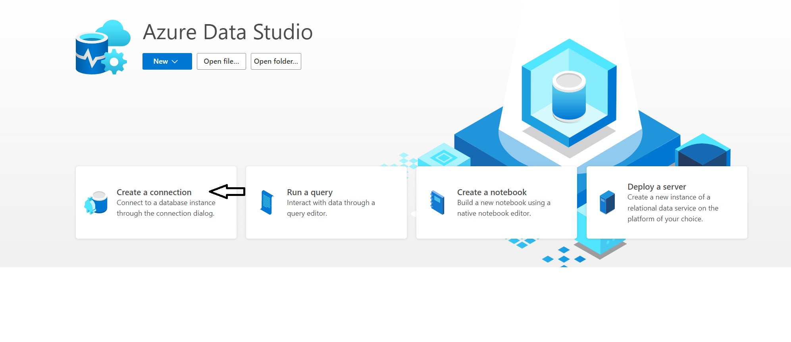
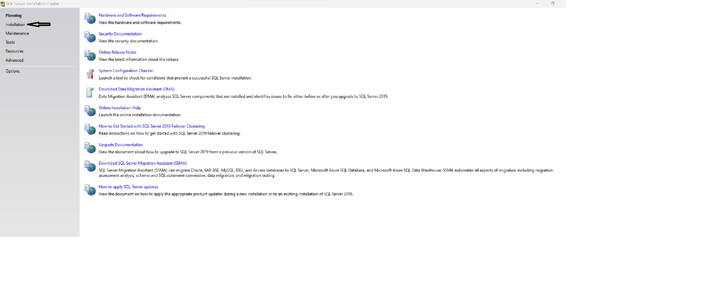

# Setting up the Microsoft Azure Database

### Install necessarry requirements
Both can be installed, most of the work will be done using Azure Data Studio. SQL Server Manaement Studio is more advanced but allows for more control.
- [Azure Data Studio](https://learn.microsoft.com/en-us/sql/azure-data-studio/download-azure-data-studio?view=sql-server-ver16&tabs=redhat-install%2Credhat-uninstall) 
- [SQL Server Management Studio](https://learn.microsoft.com/en-us/sql/ssms/download-sql-server-management-studio-ssms?view=sql-server-ver16)

### Connecting to Database
- Refer to [Azure Data Studio Connecting to Database](https://learn.microsoft.com/en-us/sql/azure-data-studio/quickstart-sql-database?view=sql-server-ver16&source=recommendations)
- Connect to the database. 
- Ensure correct details are entered.
- Begin working with the data.

### How Database Will Work with Frugl
- User information will be sent to database (Examples include username and password).
- User data will be queried from the database (Example includes recent orders).

## Optional
Using Microsoft SQL Server will allow anyone to test a local database on their machine if configured the same as the Azure database. This could be useful for testing.
- [Microsoft SQL Server download (Developer Version)](https://www.microsoft.com/en-us/sql-server/sql-server-downloads)

### Setup SQL Server

- Refer to [SQL Server setup](https://learn.microsoft.com/en-us/sql/sql-server/install/what-s-new-in-sql-server-installation?view=sql-server-ver16)
- Setup basic installation of SQL Server 
- Proceed with basic setep and modify any needed parameters.
- After SQL server is setup, start SQL Server Management Studio. Refer to [SQL Server Management Setup](https://learn.microsoft.com/en-us/sql/ssms/download-sql-server-management-studio-ssms?view=sql-server-ver16)
- Connect to the server that has been setup.
