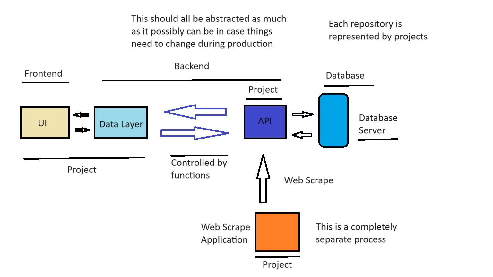

# Application Structure
</a>

### Suggestions can be put into issues section.

# Database Tables

### User Table
- Primary Key - UserID
- Username
- Password

### Orders
- Primary Key - OrderID
- UserID
- Date
- Items

### Items
- Primary Key - ItemID
- ItemName

### Stores
- Primary Key - StoreName, StorePostalCode
- StoreAddress

### AreaItems
- Primary Key - StorePostalCode, ItemID
- StoreName
- ItemPrice
