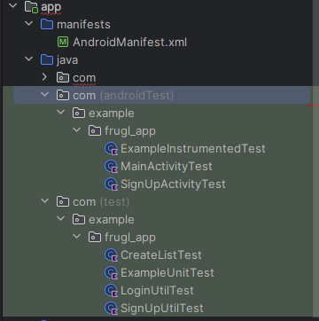
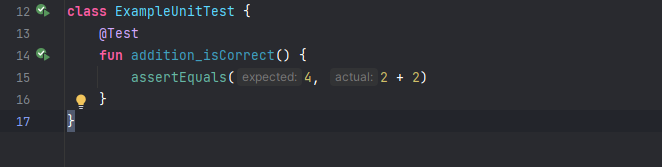

# Frugl

  
   
  
  
        </a>

# User Manual
The user manual along with installation instructions can be found here: [User Manual](User_Manual.md)

# Why Frugl?

Frugl compares the cost of specific grocery items to increase the amount of money a customer can save. The application is not worried about really specific factors,
such as coupons. The application is however, concerned with sale prices in the store. To be more specific, items that are on sale by themselves, meaning without the need to buy certain
items along side it. For this reason the application is aims to get customers cheap prices fast. Saving customers any amount in this situation, is what the application strives to do.

# Project Status
The main build is finished. The application is fully released with changes that may occur in future. This includes finishing goals that were set to be finished on launch.

# A Better Way to Save

### Strategy

- Application aims to cut down customer's grocery bill.
- Plan which stores the user should, to grab x item from said store.
- Update prices to provide accurate results.

# Goals

### Main Goals
- Expand the amount of stores featured on Frugl (big name stores to start).
- Update prices daily and in a efficient matter to the database.
- Have recent orders tracked. This is not fully finished in the final release.
- Provide excellent user security. Eventually wanted to integrate with Google to log in.

### Far Reaching Goals
- Provide the most effiecent path to each store.
- Expand application to web in addition to the original mobile application.

# General Project Structure

### Project Section

Apply the Scrum sprints to this section. Ensure that each sprint has the appropriate amount of work and each task is assigned correctly.
Tasks that are not finished in the intented time should remain as in progress in this section.

### Issues

Create issues in this section tailored towards problems that arrised, or will arrise in the future. Issues could range in severity, so put an emphasis on the priority of the problem.

### Branching and Merging

Seperate branches will be created for each new feature within the project. Ensure commits are made often and pushed, to reduce the amount problems that could result.
All merges must be reviewed by a least one fellow programer, to ensure any bugs or errors are caught.

# Contact Information

### Developer Contacts
- justyden - tylert123@yahoo.com
- afeins19 - afeinberg35@gmail.com
- sma6629 - mansib.syedahmed@gmail.com
- BabyKangaroo117 (Joseph Porrino) - joeyporrino1998@gmail.com
- Taazkir - tazkirnasir95@gmail.com

### Ideas or Suggestions
Any ideas or recommendations, feel free to contact the developers.

# How to Run Frugl (Final Release)

### Build Systems, Testing, and Continuous Integreation
- The build systems, testing, and continuous integration can be found within the GitHub actions of this application. It is contained in a .yml file. [The .yml File](.github/workflows/android.yml)
- The build systems, testing, and continuous integreation for the API can be found at [Frugl API](https://github.com/justyden/FruglAPI).
- Please visit the .github/workflows/android.yml to see all build parameters.
  
### Downloads
- The IDE used for Frugl development is [Android Studio](https://developer.android.com/studio). This application currently runs on the Giraffe version of Android Studio.
- An Android emulator is needed for Frugl, which can be downloaded from inside the Android Studio IDE. Please download the correct emulator for the application to function properly. For best experience use Pixel 7 Pro with API 34.
- [Link to the User Manual](User_Manual.md)

## 1. System Requirements
### Windows
The following are the system requirements for Android Studio on Windows.

- 64-bit Microsoft® Windows® 8/10/11
- x86_64 CPU architecture; 2nd generation Intel Core or newer, or AMD CPU with support for a  [Windows Hypervisor](https://developer.android.com/studio/run/emulator-acceleration#vm-windows)
- 8 GB RAM or more
- 8 GB of available disk space minimum (IDE + Android SDK + Android Emulator)
- 1280 x 800 minimum screen resolution

### macOS
The following are the system requirements for Android Studio on macOS.

- MacOS® 10.14 (Mojave) or higher
- ARM-based chips, or 2nd generation Intel Core or newer with support for  [Hypervisor Framework](https://developer.android.com/studio/run/emulator-acceleration#vm-mac)
- 8 GB RAM or more
- 8 GB of available disk space minimum (IDE + Android SDK + Android Emulator)
- 1280 x 800 minimum screen resolution

## 2. Windows: Download and Install Android Studio

### Download Android Studio

1. Open any web browser and navigate to the  [Android Studio download page](https://developer.android.com/studio#get-android-studio).

This is the Android Developers website, where you can download Android Studio. __This page automatically detects your operating system.__

2. Click **Download Android Studio**. The **Terms and Conditions** page with the Android Studio **License Agreement** opens.
3. Read the **License Agreement**.
4. At the bottom of the page, if you agree with the terms and conditions, select the **I have read and agree with the above terms and conditions** checkbox.
5. Click **Download Android Studio** to start the download.
6. When prompted, save the file to a location where you can easily locate it, such as the `Downloads` folder.
7. Wait for the download to complete. This may take a while and may be a good moment to enjoy some tea!

### Install Android Studio on Windows

1. Open the folder where you downloaded and saved the Android Studio installation file.
2. Double-click the downloaded file.
3. If you see a **User Account Control** dialog about allowing the installation to make changes to your computer, click **Yes** to confirm the installation.

The **Welcome to Android Studio Setup** dialog displays.

4. Click **Next** to start the installation.
5. Accept the default installation settings for all steps.
6. Click **Finish** when the installation is done to launch Android Studio.

7. Choose your preference of light or dark theme when Android Studio first launches. Screenshots in this course use the light theme, but choose whichever one you prefer.

8. During the installation, the setup wizard downloads and installs additional components and tools needed for Android app development. This may take some time depending on your internet speed. During this time, you may see a **User Account Control** dialog for **Windows Command Processor**. Click **Yes** to accept the dialog.

9. You may also receive a **Windows Security Alert** about adb.exe. Click **Allow Access,** if needed, to continue the installation.

10. When the download and installation completes, click **Finish**.

The **Welcome to Android Studio** window displays and you're ready to start creating apps!

## 2. macOS: Download and install Android Studio
### Download Android Studio

1. Open any web browser and navigate to the  [Android Studio download page](https://developer.android.com/studio/?gclid=Cj0KCQiAjJOQBhCkARIsAEKMtO3zEhdK4_I0CEZic3UH4dl-9gVXuHFR9dCl3TOHKjmv3xWLU3UxfhYaApfAEALw_wcB&gclsrc=aw.ds). This is the Android Developers website, where you can download Android Studio. This page automatically detects your operating system.
2. Click **Download Android Studio**. The **Terms and Conditions** page with the Android Studio **License Agreement** opens.
3. Read the **License Agreement**.
4. At the bottom of the page, if you agree with the terms and conditions, select the **I have read and agree with the above terms and conditions** checkbox.
5. Click **Mac with Intel chip** or **Mac with Apple chip** to start the download.
6. When prompted, save the file to a location where you can easily locate it, such as the `Downloads` folder.
7. Wait for the download to complete. This may take a while and may be a good moment to enjoy some tea!

### Install Android Studio on macOS

1. Open the folder where you downloaded and saved the Android Studio installation file.
2. Double-click the downloaded file. The following dialog displays:

3. Drag the **Android Studio** icon to the `Applications` folder.
4. In the `Applications` folder, double-click the **Android Studio** icon to launch the **Android Studio Setup Wizard**.
5. If you see a warning about installing or running a file downloaded from the Internet, accept the installation.

6. Follow the **Android Studio Setup Wizard** and accept the default settings for all steps. During the installation, the setup wizard downloads and installs additional components and tools needed for Android app development. This may take some time, depending on your internet speed. So, you could go refill your tea cup!
7. When the installation completes, Android Studio starts automatically.

The **Welcome to Android Studio** window opens and you're ready to start creating apps!

#### Conclusion 
Congratulations! You've successfully installed Android Studio. Now you're ready for the next step!

If you ran into any technical difficulties with the installation steps, refer to the [troubleshooting guide](https://developer.android.com/studio/troubleshoot).

##### Summary

- An Integrated Development Environment, or IDE, is a collection of tools for developing software.
- Android Studio is the IDE based on IntelliJ IDEA used for Android development.

##### Learn more

- [Vocabulary for Android Basics in Kotlin](https://developer.android.com/courses/android-basics-kotlin/android-basics-kotlin-vocab)
- [Download Android Studio](https://developer.android.com/studio/)
- [Install Android Studio](https://developer.android.com/studio/install)
- [Meet Android Studio](https://developer.android.com/studio/intro)

## 3. Configure Android Studio and Run Frugl

### Downloading the Android Virtual Device (AVD) & Emulator Setup

In order to run our app on your machine, you'll need to emulate an android phone. Android Studio has a built-in Device manager and emulator for running your Android Virtual Device (AVD). Please follow the attached link for guidance on setting up and using your AVD. ****Please Use the Specifications Listed Below in the Quick Start Section for your AVD****

Setting up your AVD: https://developer.android.com/studio/run/managing-avds

AVD Usage Basics: https://developer.android.com/studio/run/emulator

### Quickstart: Android Emulator API and SDK Setup 
certain features (especially new ones) realsed for the Android Ecosystem require a minimum API version to run. Frugl was written and tested on a device running API Version 34. Please you have at least this version of android on your emulator or device.

Below are some specifications about the device that we emulated and tested our project on:

**Emulator API Properties:**

- AvdId Pixel_3a_API_34_extension_level_7_x86_64
- disk.dataPartition.size 6442450944
- hw.device.name pixel_3a
- image.androidVersion.api 34

**SDK Properties**
- minSdk 24
- targetSdk 33

### Gradle File: 

Please ensure the gradle file for the **app** (Path: build.gradle)
matches this 

plugins {
    id 'com.android.application'
    id 'org.jetbrains.kotlin.android'
}

android {
    namespace 'com.example.frugl_app'
    compileSdk 33

    defaultConfig {
        applicationId "com.example.frugl_app"
        minSdk 24
        targetSdk 33
        versionCode 1
        versionName "1.0"

        testInstrumentationRunner "androidx.test.runner.AndroidJUnitRunner"
    }

    buildTypes {
        release {
            minifyEnabled false
            proguardFiles getDefaultProguardFile('proguard-android-optimize.txt'), 'proguard-rules.pro'
        }
    }
    compileOptions {
        sourceCompatibility JavaVersion.VERSION_1_8
        targetCompatibility JavaVersion.VERSION_1_8
    }
    kotlinOptions {
        jvmTarget = '1.8'
    }
}

dependencies {

    implementation 'androidx.core:core-ktx:1.7.0'
    implementation 'androidx.appcompat:appcompat:1.6.1'
    implementation 'com.google.android.material:material:1.9.0'
    implementation 'androidx.constraintlayout:constraintlayout:2.1.4'
    implementation 'io.github.cdimascio:dotenv-kotlin:6.4.1'
    implementation files('libs/jtds-1.3.1.jar')

    testImplementation 'com.google.truth:truth:1.1.2'
    testImplementation 'junit:junit:4.13.2'

    androidTestImplementation 'androidx.test.ext:junit:1.1.5'
    androidTestImplementation 'androidx.test.espresso:espresso-core:3.5.1'
    androidTestImplementation 'androidx.test:rules:1.4.0'
    androidTestImplementation 'androidx.test.espresso:espresso-intents:3.4.0'
}

### Setting Up 

1. **Unzip Project:**
    
    - Download the Frugl App project file and unzip it to a location of your choice.
2.  **Open in Android Studio:**
    
    - Launch Android Studio.
    - Click on "File" > "Open..."
    - Navigate to the unzipped Frugl App project folder and select it.
    - Click "OK" to open the project.
    
3. **Configure Emulator:**
    
    - Find the device manager button on the right toolbar and click it.
    
4. **Create Virtual Device (Emulator):**
    
    - In the AVD Manager, click "Create Virtual Device."
    - Choose the hardware profile __Pixel 7 Pro__and click "Next."
  
      
    
5. **Select System Image:**
    
    - Choose the __API 34__ system image for the emulator from the __Other Images__ tab and click "Next."
    - Click "Finish". 'Download and accept the license agreement if prompted.
    
6. **Run Emulator:**
	
	- Back in the AVD Manager, click the green "Play" button to start the emulator.
	- Wait for the emulator to launch.
	
7. **Verify Setup:**
	
	- Open a new or existing Android Studio project.
	- Click "Run" (green triangle) to build and run the app on the emulator.
	
8. **Configure SDK Versions:**
    
    - Open the `build.gradle` file located in the `app` directory.
    - Confirm that the `minSdk` is set to 24, `targetSdk` is set to 33, and `compileSdk` is set to 33.
    
9. **Configure Dependencies:**
    
    - Open the `build.gradle` file located in the `app` directory.
        
    - Review and verify the dependencies listed in the `dependencies` block. Ensure they match the following:
        `implementation 'androidx.core:core-ktx:1.7.0' implementation 'androidx.appcompat:appcompat:1.6.1' implementation 'com.google.android.material:material:1.9.0' implementation 'androidx.constraintlayout:constraintlayout:2.1.4' implementation 'io.github.cdimascio:dotenv-kotlin:6.4.1'  testImplementation 'com.google.truth:truth:1.1.2' testImplementation 'junit:junit:4.13.2'  androidTestImplementation 'androidx.test.ext:junit:1.1.5' androidTestImplementation 'androidx.test.espresso:espresso-core:3.5.1' implementation 'androidx.recyclerview:recyclerview:1.2.1'  // Retrofit implementation 'com.squareup.retrofit2:retrofit:2.9.0' implementation 'com.squareup.retrofit2:converter-gson:2.9.0'`
        
10. **Sync Gradle:**
    
    - Click "Sync Now" in the bar that appears at the top of Android Studio to synchronize the project with the updated configurations.
    
11. **Verify Device Connection:**

	- In the toolbar, check that the emulator is listed as a target device.
	- Ensure the emulator is selected before running the app.
	
12. **Run the App:**
    
    - Click "Run" (green triangle) to build and run the Frugl App on the emulator.
    
13. **Verify Emulator Connection:**
    
    - Ensure that the emulator is connected and responsive.
    - Confirm that the Frugl App runs smoothly on the emulator.
    
14. **Congratulations:**
	
	- You've successfully configured Android Studio and launched your app on the emulator!

## Using Frugl
1. **Launch Application
	- After clicking "Run" the app should open to the home screen
	- If not, click the Android logo (green logo with Android bot) in the app drawer of the emulator
2. **Login
	- Click the "LOGIN" or "SIGN UP" button to get started
	- If using Login, enter 
		- Username: username
		- Password: password
	- NOTE: **Both fields are case-sensitive, so verify that the credentials match exactly 
	- Click "LOGIN" to navigate to the Homepage
3. **Homepage
	- The homepage contains 4 buttons to navigate the app (Search, Cart, Maps, Account)
	- Click on the search icon to access the search page
	- NOTE: **The Maps activity has not been implemented yet
4. **Search
	-  Click the magnifying glass to activate the search bar
	- Type in popular grocery item names to see which are available in stores
	- Verify that the product description matches the item and that both total and unit prices are visible
	- The product image is replaced by the app's logo as a placeholder, and the store logo is always set to "Wegmens" as a placeholder
	- NOTE: **Add to Cart button is not functional 
5. **Grocery Cart
	- Click on "CART" from the top navigation bar to access the grocery cart
	- Click the magnifying glass to activate the search bar
	- Type in popular grocery item names to see which are available in stores
	- NOTE: **Available Inputs: Apples, Apricot, Banana, Chicken, Cheese
	- From the suggestion list, select your desired item
	- Item will display below the search bar
	- To add more of the same item, search it again and click on the suggestion 
	- The item count will go up by one
	- Click the "DELETE" button to remove the item from the list
6. **User Account
	- Click the "ACCOUNT" button to access user information
	- Account page will display placeholder data for the user's name, email, address
	- Users will have the option to set a search radius from the User Account page
	- NOTE: ** Access the app using the "SIGN UP" button from the landing page and fill in the form to view your details in the Account page

## Testing
testing is performed with **JUnit4**. Test are able to be run easily within android studio in the following way: 

Within the Java folder, you will find 2 subdirectories (test and androidtest)

### Unit Tests
unit tests run the foundational aspects of your code and are limited to the output of a single function. 
These tests are placed in the test folder (java/com/example/frugl_app). LoginUtilTest and SignUpUtilTest are
prewritten unit tests 

### Integration & androidtests:
android tests represent testing that android specific tasks (such as activity changes) work. These are placed
int the androidtest folder (java/com/example/frugl_app). 

### Running Tests: 
Tests may be easily run within android studio as it features built-in testing support.

you may run tests in the following ways
- pressing the green "play" button next to the line number next to a test **class**. This will run
every test function in the class.
-  pressing the green "play" button next to the line number next to a test
  **function** and only test that specific function.

## Common Issues 

### Gradle
please ensure that you have performed a gradle sync. Gradle is the build system used to manage dependencies within android studio and will 
automatically fetch libraries for your project as needed. Sometimes performing a "sync" operation may resolve issues related to having 
missing dependencies. 

Please refer to this guide from JetBrains on syncing your gradle: https://www.jetbrains.com/guide/java/tutorials/working-with-gradle/syncing-and-reloading/

### API Version  
certain features (especially new ones) realsed for the Android Ecosystem require a minimum API version to run. Frugl was written and tested on a device running 
**API Version 34**. Please you have at least this version of android on your emulator or device.

Below are some specifications about the device that we emulated and tested our project on: 

Properties:
- AvdId                    Pixel_3a_API_34_extension_level_7_x86_64
- disk.dataPartition.size  6442450944
- hw.device.manufacturer   Google
- hw.device.name           pixel_3a
- image.androidVersion.api 34

